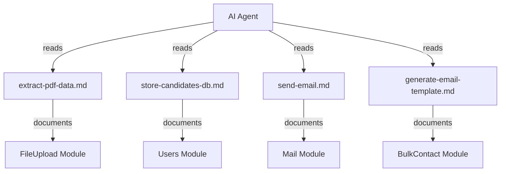

# Design Document: Agent Skill Files

## Overview

This feature creates four markdown skill files in `.kiro/skills/` that serve as structured reference documents for the AI agent. Each skill file documents a specific workflow in the Jobfinder project — PDF resume extraction, candidate data persistence, email sending, and AI template generation — following a consistent internal structure (Purpose, Relevant Files, Key Interfaces, Workflow Steps, Constraints, Expected Output).

The skill files are static documentation artifacts. They do not contain executable code; they guide the agent's understanding of domain-specific workflows so it can produce correct code changes when modifying or extending these subsystems.

## Architecture

The skill files sit in a flat directory at `.kiro/skills/` and are loaded by the Kiro agent on demand when the user invokes a workflow related to one of the four domains:

```
.kiro/
└── skills/
    ├── extract-pdf-data.md         → FileUpload module workflow
    ├── store-candidates-db.md      → Users module persistence workflow
    ├── send-email.md               → Mail module sending workflow
    └── generate-email-template.md  → BulkContact template workflow
```



Each skill file is self-contained and references only its own module's source files. Cross-module relationships (e.g., the resume parse processor calling `UsersService.saveResume`) are mentioned in workflow steps but the detailed interface documentation lives in the skill file for the owning module.

### Design Decisions

1. **Flat directory structure**: All four skill files live at the same level in `.kiro/skills/`. No subdirectories — the filenames are descriptive enough and there are only four files.
2. **No inter-file linking**: Each skill file is designed to be read in isolation. The agent picks the relevant skill for the task at hand.
3. **Markdown format with code blocks**: Interface definitions use TypeScript fenced code blocks. File paths use inline code. This matches Kiro skill file conventions and enables syntax highlighting in editors.
4. **Fixed section order**: All files follow the same section sequence (Purpose → Relevant Files → Key Interfaces → Workflow Steps → Constraints → Expected Output) so the agent can predict where to find information.

## Components and Interfaces

### Skill File: `extract-pdf-data.md`

Documents the FileUpload module pipeline:

| Component | Role |
|-----------|------|
| `file-upload.controller.ts` | HTTP endpoint for PDF upload and reparse triggers |
| `file-upload.service.ts` | Orchestrates upload to Cloudinary and enqueues BullMQ job |
| `resume-parse.processor.ts` | BullMQ worker that extracts text and calls Ollama |
| `ollama.helper.ts` | LLM interaction with 3-attempt retry and JSON cleaning |
| `resume-job.types.ts` | Queue constants and job payload interfaces |
| `dto/upload-resume.dto.ts` | Request validation for upload endpoint |

Key interfaces documented:
- `ResumeParseJobData` — Redis job payload (userId, cloudinaryUrl, cloudinaryId, rawText, pdfBase64)
- `ResumeParseJobResult` — Processor return value (userId, cloudinaryUrl, rawText, parsedJson, llmAttempts)
- `OllamaParseResult` — Helper return value (parsedJson, llmAttempts, rawText)
- Resume JSON schema — 11 top-level fields (name, email, phone, location, summary, skills, experience, education, certifications, languages, projects)

### Skill File: `store-candidates-db.md`

Documents the Users module persistence layer:

| Component | Role |
|-----------|------|
| `users.controller.ts` | HTTP endpoints for profile CRUD |
| `users.service.ts` | Business logic for resume save and profile extraction |
| `users.repository.ts` | Mongoose data access (repository pattern) |
| `user.schema.ts` | User document schema with nested profile sub-schemas |
| `profile-extractor.ts` | JSON-to-profile mapping and regex-based raw text fallback |
| `users.module.ts` | NestJS module wiring |
| `dto/create-user.dto.ts` | User creation validation |
| `dto/update-profile.dto.ts` | Profile update validation |
| `dto/mongo-id-param.dto.ts` | ObjectId param validation |

Key interfaces documented:
- `UserDocument` — Mongoose document with resume, profile, and auth fields
- `UserProfile` — Structured editable profile (phone, location, headline, bio, skills, experience, education, etc.)
- `ExperienceItem`, `EducationItem`, `ProjectItem` — Nested sub-schemas
- `RefreshTokenEntry` — Auth token entry
- `CreateUserDto`, `UpdateProfileDto` — Request DTOs

### Skill File: `send-email.md`

Documents the Mail module sending pipeline:

| Component | Role |
|-----------|------|
| `mail.module.ts` | NestJS module with BullMQ queue registration |
| `mail.controller.ts` | HTTP endpoints for enqueue and status polling |
| `mail.service.ts` | Enqueues jobs, queries job state |
| `mail.processor.ts` | BullMQ worker — sends via Nodemailer |
| `mail-from.schema.ts` | Sender identity Mongoose schema |
| `mail-from.service.ts` | Resolves active sender address |
| `mail-job.types.ts` | Queue constants and job payload interfaces |
| `mail-result.schema.ts` | Per-recipient result tracking for template sends |
| `bull-redis.config.ts` | Shared Redis connection factory |
| `dto/send-bulk-mail.dto.ts` | Request validation |

Key interfaces documented:
- `BulkMailJobData` / `BulkMailJobResult` — Legacy bulk send payloads
- `TemplateMailJobData` / `TemplateMailJobResult` — Per-recipient template send payloads
- Queue constants: `MAIL_QUEUE`, `MAIL_JOB`, `TEMPLATE_MAIL_JOB`
- `MailResult` schema — Per-recipient delivery tracking
- `SendBulkMailDto` — Request DTO

### Skill File: `generate-email-template.md`

Documents the BulkContact template generation workflow:

| Component | Role |
|-----------|------|
| `template-generator.service.ts` | AI template generation with Ollama + caching |
| `personalization.service.ts` | Placeholder replacement ({{name}}, {{company}}, {{title}}) |
| `bulk-contact.controller.ts` | HTTP endpoints for template operations |
| `bulk-contact.service.ts` | Orchestrates grouping, generation, and bulk send |
| `email-template.schema.ts` | Template Mongoose schema with upsert index |
| `contact-group.schema.ts` | Contact group schema |
| `dto/generate-templates.dto.ts` | Generation request validation |
| `dto/edit-template.dto.ts` | Manual template edit validation |

Key interfaces documented:
- `EmailTemplate` / `EmailTemplateDocument` — Cached template schema
- `ContactGroup` / `ContactGroupDocument` — Group schema
- `TemplateInput`, `RecipientInput`, `PersonalizedOutput` — Personalization types
- `GenerateTemplatesDto` — Request DTO

## Data Models

The skill files themselves are plain markdown files with no runtime data. However, they document the following data models that exist in the system:

### Resume JSON Schema (documented in `extract-pdf-data.md`)

```typescript
interface ParsedResume {
  name: string | null;
  email: string | null;
  phone: string | null;
  location: string | null;
  summary: string | null;
  skills: string[];
  experience: Array<{
    company: string;
    title: string;
    startDate: string;
    endDate: string;
    description: string;
  }>;
  education: Array<{
    institution: string;
    degree: string;
    field: string;
    startDate: string;
    endDate: string;
  }>;
  certifications: string[];
  languages: string[];
  projects: Array<{
    name: string;
    description: string;
    technologies: string[];
  }>;
}
```

### User Document Fields (documented in `store-candidates-db.md`)

```typescript
// Relevant fields on UserDocument for the persistence workflow
interface UserResumeFields {
  resume: Record<string, any>;           // Raw Ollama parse output
  resumeRawText?: string;                // Plain text from pdf-parse
  resumeCloudinaryUrl?: string;          // PDF storage URL
  resumeCloudinaryId?: string;           // Cloudinary asset ID
  resumeVersions?: Array<Record<string, any>>;  // Archive of previous parses
  profile: UserProfile;                  // Structured editable profile
}
```

### Email Template Document (documented in `generate-email-template.md`)

```typescript
interface EmailTemplateFields {
  groupId: ObjectId;          // Reference to ContactGroup
  userId: ObjectId;           // Owner
  subject: string;            // Max 200 chars
  body: string;               // Max 2000 chars
  generatedBy: 'ai' | 'manual';
  cachedAt: Date;
}
```

### Skill File Structure (all four files)

Each skill file follows this markdown structure:

```markdown
# {Skill Title}

## Purpose
{1-3 sentences describing what the workflow accomplishes}

## Relevant Files
- `backend/src/{module}/{file}.ts` — {one-line role description}
- ...

## Key Interfaces
```typescript
interface ExampleInterface {
  field: type;
}
```
{One sentence describing the interface's role}

## Workflow Steps
1. {First step from trigger}
2. {Subsequent steps}
...
N. {Final step to completion}

## Constraints
- {Technical limitation or rule}
- ...

## Expected Output
{1-3 sentences describing the successful result}
```

## Error Handling

Since the skill files are static markdown documents read by the AI agent, there is no runtime error handling within the files themselves. However, each skill file documents the error handling strategy of the workflow it describes:

| Skill File | Documented Error Handling |
|------------|--------------------------|
| `extract-pdf-data.md` | 3-attempt LLM retry with escalating prompts; fallback skeleton with `_parseError` metadata on total failure; JSON repair strategies (strip fences, extract braces, fix trailing commas) |
| `store-candidates-db.md` | Duplicate email conflict (unique index); NotFoundException for missing users; fallback to regex extraction when JSON parse yields empty profile |
| `send-email.md` | 3-attempt retry with exponential backoff (5s base); partial failure tolerance in bulk sends; per-recipient result tracking; SMTP credential validation at transporter creation |
| `generate-email-template.md` | Ollama failure → manual fallback (empty subject/body, `generatedBy: 'manual'`); JSON parse failure → regex extraction of subject/body; 60s timeout on Ollama calls |

## Testing Strategy

Since this feature produces markdown documentation files (not executable code), property-based testing does not apply. The skill files have no inputs, no outputs, and no runtime behavior — they are static artifacts read by the AI agent.

### Appropriate Testing Approach

**Structural validation tests** (example-based):
- Verify each skill file exists at the expected path
- Verify each file contains all required sections in the correct order (Purpose, Relevant Files, Key Interfaces, Workflow Steps, Constraints, Expected Output)
- Verify section headings use correct markdown heading levels (# for title, ## for sections)
- Verify file paths in "Relevant Files" sections use inline code formatting
- Verify TypeScript interfaces use fenced code blocks

**Content completeness checks** (example-based):
- Verify each "Relevant Files" section lists at least one file
- Verify each "Workflow Steps" section contains at least two numbered steps
- Verify each "Constraints" section contains at least one bullet point
- Verify the title heading matches the filename stem in title case

**Why PBT does not apply:**
- Skill files are static configuration/documentation — not functions with inputs and outputs
- There is no input space to generate random values from
- The correctness criteria are structural (section presence, ordering, formatting) rather than behavioral
- Example-based assertions with exact checks are the appropriate strategy

### Test Implementation

Tests should be implemented using Jest (the project's existing test runner) with simple file-read and regex-match assertions. Each acceptance criterion from Requirements 1-5 maps to one or more `it()` blocks that read the file and assert structural properties.
