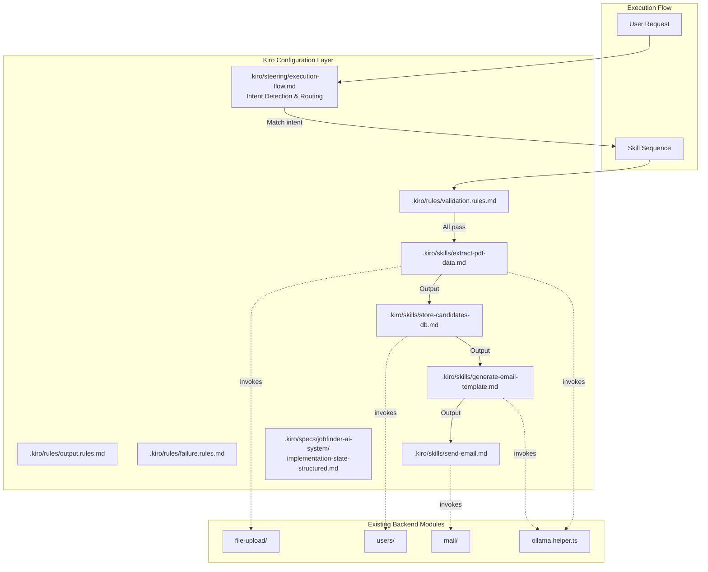

# Design Document: Agent System Upgrade

## Overview

This design defines the production-grade Kiro configuration file set (skills, steering, rules) that enables the development agent to execute the Jobfinder pipeline deterministically: PDF data extraction → database storage → email automation with AI-generated templates.

The system is purely additive — no existing code, specs, or configuration files are modified. Each configuration file is self-contained, modular, and references actual project file paths and method signatures so the agent operates without ambiguity.

### Key Design Decisions

1. **Skill files as imperative runbooks** — Each skill file is a step-by-step procedure the agent follows literally, not a description of what could be done. This eliminates interpretation variance.
2. **Steering as a routing table** — The execution flow steering file acts as a deterministic router: intent → skill sequence. No LLM reasoning decides which skill to call.
3. **Rules as pre-conditions** — Rule files are evaluated as boolean checklists before any skill executes. A single failure halts execution.
4. **YAML for machine state** — The implementation state file uses fenced YAML so the agent can parse module status without regex heuristics.

## Architecture



### File Organization

```
.kiro/
├── skills/
│   ├── extract-pdf-data.md          (≤80 lines)
│   ├── store-candidates-db.md       (≤60 lines)
│   ├── send-email.md                (≤70 lines)
│   └── generate-email-template.md   (≤80 lines)
├── rules/
│   ├── validation.rules.md          (≤60 lines)
│   ├── output.rules.md              (≤50 lines)
│   └── failure.rules.md             (≤60 lines)
├── steering/
│   └── execution-flow.md            (≤120 lines)
└── specs/jobfinder-ai-system/
    └── implementation-state-structured.md (≤200 lines)
```

## Components and Interfaces

### Skill Files

Each skill file follows a uniform structure:

```markdown
# Skill: <name>
## Trigger
<when this skill is invoked>
## Inputs
<required and optional parameters with types>
## Steps
<numbered imperative steps>
## Output
<expected response format>
## Error Handling
<skill-specific failure modes>
```

#### extract-pdf-data.md

| Section | Content |
|---------|---------|
| Trigger | User requests parsing/extracting data from a PDF resume |
| Inputs | `file` (PDF, ≤15MB), `userId` (MongoDB ObjectId) |
| Steps | 1. Validate inputs → 2. Call `file-upload.service.ts::uploadResume(file, userId)` → 3. Poll `getParseJobStatus(jobId)` every 3s up to 30 times → 4. Return parsed JSON |
| Output | Structured JSON with fields: name, email, phone, location, summary, skills, experience, education, certifications, languages, projects |
| Invokes | `backend/src/file-upload/file-upload.service.ts`, `backend/src/file-upload/resume-parse.processor.ts`, `backend/src/file-upload/ollama.helper.ts` |

#### store-candidates-db.md

| Section | Content |
|---------|---------|
| Trigger | User intent involves saving/persisting candidate or resume data |
| Inputs | JSON object with `name` (required), `email` (required), and optional profile fields matching `UserProfile` interface |
| Steps | 1. Validate required fields → 2. Call `usersRepository.findByEmail(email.toLowerCase().trim())` → 3a. If exists: `usersRepository.updateProfile(user, profileFields)` → 3b. If new: `usersRepository.create({name, email})` then `updateProfile` → 4. Return stored document with `_id` |
| Output | MongoDB document JSON including generated `_id` |
| Invokes | `backend/src/users/users.repository.ts`, `backend/src/users/user.schema.ts` |

#### send-email.md

| Section | Content |
|---------|---------|
| Trigger | User requests sending emails, outreach messages, or bulk mail |
| Inputs | `mailIds` (string[], RFC 5322 emails), `subject` (non-empty string), `context` (non-empty string body), `userId` or resume PDF file |
| Steps | 1. Validate emails using `@IsEmail` rules → 2. Exclude invalid, report them → 3. Call `mail.service.ts::enqueueBulkMail(dto, resume?)` → 4. Return `jobId` for status polling |
| Output | `{ jobId: string }` — poll via `getJobStatus(jobId)` for state, sentCount, failedCount |
| Invokes | `backend/src/mail/mail.service.ts`, `backend/src/mail/mail.processor.ts`, `backend/src/mail/bull-redis.config.ts` |
| Constraints | Max 50 recipients per invocation, retry policy: 3 attempts / exponential backoff from 5s |

#### generate-email-template.md

| Section | Content |
|---------|---------|
| Trigger | User requests creating/generating/drafting outreach email content |
| Inputs | User profile data (name, headline, skills, experience), recipient context (name, title, company — all required), optional custom prompt (≤500 chars) |
| Steps | 1. Validate recipient context fields → 2. Build prompt with user profile + recipient context → 3. POST to Ollama `/api/generate` with `stream: false` → 4. Validate output (subject ≤200 chars, body ≤2000 chars, no HTML) → 5. Return plain-text email with `{{name}}`, `{{company}}`, `{{title}}` placeholders |
| Output | `{ subject: string, body: string }` — plain text with dynamic placeholders |
| Invokes | `backend/src/file-upload/ollama.helper.ts` (connection pattern only) |
| Retry | 30s timeout → retry once after 5s delay → report failure with manual template suggestion |

### Steering File

#### execution-flow.md

The steering file contains an **Intent Detection Table** mapping keyword patterns to ordered skill sequences:

| Intent Category | Keywords (case-insensitive substring) | Skill Sequence |
|----------------|---------------------------------------|----------------|
| PDF extraction only | "parse resume", "extract pdf", "parse pdf", "read resume" | `extract-pdf-data` |
| Extract + Store | "parse and save", "extract and store", "upload resume" | `extract-pdf-data` → `store-candidates-db` |
| Email generation + Send | "send outreach", "email candidates", "send email", "bulk mail" | `generate-email-template` → `send-email` |
| Full pipeline | "full pipeline", "end to end", "process resume and email" | `extract-pdf-data` → `store-candidates-db` → `generate-email-template` → `send-email` |

**Dependency Rules:**
- `store-candidates-db` requires output from `extract-pdf-data`
- `send-email` requires output from `generate-email-template` OR user-provided template
- `generate-email-template` requires user profile data (from DB or extraction output)

**Conflict Resolution:** When multiple intents match, select the category with the longest skill sequence that satisfies all matched keywords.

**Pipeline Execution:** Each skill's complete output is passed as primary input context to the next skill in sequence. On failure, halt at the failure point and report completed/failed skills.

### Rule Files

#### validation.rules.md

A numbered checklist evaluated sequentially before each skill invocation:

1. **Email validation** — local@domain.tld pattern: local 1-64 chars, domain contains ≥1 dot and is 1-253 chars, no whitespace
2. **PDF validation** — file extension ends in `.pdf` (case-insensitive), size ≤10MB
3. **Deduplication** — if email exists in DB → update existing record, never create duplicate
4. **Required fields per skill:**
   - PDF extraction: non-empty `userId` (MongoDB ObjectId format)
   - Email send: ≥1 valid recipient email
   - Template generation: user profile with non-empty `name` and ≥1 skill

On failure: stop operation, report rule number, failing value, and corrective action.

#### output.rules.md

Formatting constraints applied to all agent responses during spec/task execution:

1. Code changes → unified diffs with relative file path header
2. Structured data → JSON format
3. Explanatory text → max 5 lines × 120 chars, no qualifiers ("maybe", "perhaps", etc.)
4. Error reports → 3 fields: error type, affected component, suggested resolution
5. Multi-file changes → summary line (≤80 chars) before each diff
6. No repetition of info from prior messages in the conversation

#### failure.rules.md

Error handling rules categorized by failure type:

1. **Transient errors** (network timeout >30s, Ollama unresponsive, SMTP 4xx) → retry once after 5s
2. **Stop condition** — 2 consecutive failures on same operation → stop, report operation name + attempt count + last error
3. **Escalation** — requires user input (missing credentials, permission error, ambiguous intent) → ask with error category + affected resource + suggested resolution
4. **Partial success** (batch operations) → report succeeded count, failed count, per-item failure reasons
5. **Agent-fixable vs user-required boundary:**
   - Agent-fixable: typos in config, missing imports, wrong file paths
   - User-required: missing env vars, external service outages, architectural decisions
6. **Uncategorized errors** → report raw error with file/line/operation context, ask user

### Implementation State File

Located at `.kiro/specs/jobfinder-ai-system/implementation-state-structured.md`, contains:

- **Metadata block** — `last_updated` (ISO 8601), `version` (integer)
- **Modules array** — each module as a YAML object with: `name`, `path`, `status` (implemented | partial | not-implemented), `implemented_features` (list), `missing_features` (list), `dependencies` (list)

Covers all 10 existing modules: Users, File Upload, Jobs, Mail, Logger, Frontend, Auth, Matching, Auto-Apply, Bulk Contact.

## Data Models

### Skill File Input/Output Contracts

```typescript
// extract-pdf-data inputs
interface PdfExtractionInput {
  file: Buffer;       // PDF content, ≤15MB
  userId: string;     // MongoDB ObjectId format (24 hex chars)
}

// extract-pdf-data output (matches existing ResumeParseJobResult)
interface PdfExtractionOutput {
  name: string | null;
  email: string | null;
  phone: string | null;
  location: string | null;
  summary: string | null;
  skills: string[];
  experience: ExperienceItem[];
  education: EducationItem[];
  certifications: string[];
  languages: string[];
  projects: ProjectItem[];
}

// store-candidates-db input
interface StoreCandidateInput {
  name: string;                    // required
  email: string;                   // required
  phone?: string;
  location?: string;
  headline?: string;
  bio?: string;
  linkedin?: string;
  github?: string;
  website?: string;
  skills?: string[];
  experience?: ExperienceItem[];
  education?: EducationItem[];
  certifications?: string[];
  languages?: string[];
  projects?: ProjectItem[];
}

// store-candidates-db output
interface StoreCandidateOutput {
  _id: string;                     // MongoDB ObjectId
  name: string;
  email: string;
  profile: UserProfile;
  createdAt: string;
  updatedAt: string;
}

// generate-email-template input
interface TemplateGenerationInput {
  userProfile: {
    name: string;
    headline?: string;
    skills: string[];
    experience: ExperienceItem[];
  };
  recipient: {
    name: string;                  // required
    title: string;                 // required
    company: string;               // required
  };
  customPrompt?: string;           // ≤500 chars
}

// generate-email-template output
interface TemplateGenerationOutput {
  subject: string;                 // ≤200 chars, plain text, no HTML
  body: string;                    // ≤2000 chars, plain text, no HTML
  // May contain {{name}}, {{company}}, {{title}} placeholders
}

// send-email input
interface SendEmailInput {
  mailIds: string[];               // RFC 5322 emails, max 50
  subject: string;                 // non-empty
  context: string;                 // non-empty (email body)
  userId?: string;                 // for Cloudinary resume attachment
  resumeFile?: Buffer;             // alternative: direct PDF buffer
}

// send-email output
interface SendEmailOutput {
  jobId: string;                   // BullMQ job ID for polling
}
```

### Intent Detection Table Schema

```typescript
interface IntentEntry {
  category: string;
  keywords: string[];              // case-insensitive substring matches
  skillSequence: string[];         // ordered skill file names (without .md)
  dependencies: Record<string, string>; // skill → required predecessor output
}
```

### Implementation State YAML Schema

```yaml
metadata:
  last_updated: "2025-01-15T10:00:00Z"  # ISO 8601
  version: 1                              # integer, increments on regeneration

modules:
  - name: "Users"
    path: "backend/src/users/"
    status: "implemented"                 # implemented | partial | not-implemented
    implemented_features:
      - "CRUD operations"
      - "Profile management"
      - "Resume storage with versioning"
    missing_features: []
    dependencies:
      - "Auth"
```

### Validation Rule Schema

```typescript
interface ValidationRule {
  id: number;                      // sequential
  target: 'email' | 'pdf' | 'userId' | 'recipientContext' | 'userProfile';
  condition: string;               // human-readable boolean expression
  failureMessage: string;          // template with {value} placeholder
  correctiveAction: string;        // what valid input looks like
}
```

## Correctness Properties

*A property is a characteristic or behavior that should hold true across all valid executions of a system — essentially, a formal statement about what the system should do. Properties serve as the bridge between human-readable specifications and machine-verifiable correctness guarantees.*

### Property 1: Intent Detection Routing

*For any* user request string containing one or more keywords from the intent detection table, the intent detector SHALL return the correct skill sequence matching the category whose keywords are all present in the request.

**Validates: Requirements 1.1, 2.1, 3.1, 4.1, 5.2**

### Property 2: Email Validation Correctness

*For any* string, the email validation function SHALL accept it if and only if it matches the pattern `local@domain.tld` where local is 1-64 characters, domain contains at least one dot and is 1-253 characters, and the entire string contains no whitespace.

**Validates: Requirements 3.4, 6.2**

### Property 3: Email List Partitioning

*For any* list of strings containing a mix of valid and invalid email addresses, the email filter SHALL partition the list such that all valid emails are in the accepted set, all invalid emails are in the rejected set, and no email appears in both sets.

**Validates: Requirements 3.5**

### Property 4: Required Field Validation Per Skill

*For any* skill invocation input missing one or more required fields (userId for PDF extraction, name/email for DB storage, at least 1 valid recipient for email send, name + ≥1 skill for template generation, name/title/company for recipient context), the validation SHALL reject the input and identify exactly which required fields are absent.

**Validates: Requirements 1.5, 2.6, 4.8, 6.5**

### Property 5: Deduplication — Update Not Duplicate

*For any* candidate data where the email (lowercased, trimmed) matches an existing database record, the storage operation SHALL update the existing record's profile fields and SHALL NOT create a new document.

**Validates: Requirements 2.4, 2.5, 6.4**

### Property 6: Pipeline Output Chaining

*For any* multi-skill pipeline of length N (where N ≥ 2), skill K+1 SHALL receive the complete output of skill K as its primary input context, preserving all fields from the predecessor's output.

**Validates: Requirements 5.4**

### Property 7: Pipeline Dependency Enforcement

*For any* skill that has a declared dependency on a predecessor's output, attempting to execute that skill without the required predecessor output SHALL result in a dependency error rather than proceeding with incomplete data.

**Validates: Requirements 5.5**

### Property 8: Pipeline Failure Halting

*For any* pipeline of length N where skill K fails (1 ≤ K ≤ N), the system SHALL report all skills before K as completed (with their outputs), skill K as failed (with its error), and skills after K as not attempted.

**Validates: Requirements 5.6**

### Property 9: No-Match Intent Bypass

*For any* user request string that does not contain any keyword phrase from the intent detection table (case-insensitive substring), the system SHALL not invoke any skill and SHALL proceed with normal response generation.

**Validates: Requirements 5.7**

### Property 10: Multi-Match Conflict Resolution

*For any* user request string that matches keywords from 2 or more intent categories, the system SHALL select the category with the longest matching skill sequence.

**Validates: Requirements 5.9**

### Property 11: Template Output Validation

*For any* generated email template output, the validation function SHALL accept it if and only if the subject is non-empty and ≤200 characters, the body is non-empty and ≤2000 characters, and neither contains HTML tags.

**Validates: Requirements 4.6**

### Property 12: Validation Failure Reporting

*For any* validation rule failure, the error report SHALL contain exactly three elements: the rule number that failed, the input value that caused the failure, and a corrective action describing what valid input looks like.

**Validates: Requirements 6.6**

### Property 13: Error Classification

*For any* error encountered during skill execution, the failure handling system SHALL classify it into exactly one category: transient (network timeout >30s, Ollama unresponsive, SMTP 4xx), agent-fixable (typos, missing imports, wrong paths), or user-required (missing env vars, service outages, architectural decisions).

**Validates: Requirements 8.1, 8.6**

### Property 14: Retry and Stop Logic

*For any* transient error, the system SHALL retry once after a 5-second pause. *For any* operation that fails 2 consecutive times, the system SHALL stop retrying and report the operation name, attempt count, and last error — regardless of error category.

**Validates: Requirements 8.2, 8.3**

### Property 15: Partial Success Reporting

*For any* batch operation with N items where S succeed and F fail (S + F = N), the partial success report SHALL contain the exact counts (S succeeded, F failed) and for each failed item, its identifier and failure reason.

**Validates: Requirements 8.5**

### Property 16: PDF Validation

*For any* file reference, the PDF validation SHALL accept it if and only if the filename ends in `.pdf` (case-insensitive) and the file size is ≤10MB.

**Validates: Requirements 6.3**

### Property 17: Implementation State Schema Validity

*For any* module entry in the implementation state YAML, it SHALL contain all required fields (name, path, status, implemented_features, missing_features, dependencies) where status is one of `implemented`, `partial`, or `not-implemented`, and the lists may be empty but must be present.

**Validates: Requirements 9.2, 9.5**

## Error Handling

### Skill-Level Errors

| Error Type | Source | Handling |
|------------|--------|----------|
| Invalid input (missing fields, bad format) | Validation rules | Halt immediately, report rule number + failing value + corrective action |
| PDF too large (>10MB / >15MB) | Validation rules | Reject with size info and max allowed |
| Ollama timeout (>30s) | Template generation, PDF extraction | Retry once after 5s delay, then escalate |
| SMTP 4xx (temporary failure) | Email send | Retry via BullMQ backoff (3 attempts, exponential from 5s) |
| BullMQ job failure | PDF extraction, email send | Report failure reason from job status |
| Polling timeout (30 attempts) | PDF extraction | Stop polling, report jobId for manual follow-up |
| Duplicate email in DB | DB storage | Update existing record (not an error — handled by dedup logic) |
| All recipients invalid | Email send | Halt, report all invalid entries, don't enqueue |
| Template validation failure | Template generation | Retry with simplified prompt, then report with manual template suggestion |

### Pipeline-Level Errors

- **Single skill failure in pipeline** — Halt pipeline at failure point. Report completed skills (with outputs) and failed skill (with error). Offer to retry the failed step.
- **Dependency missing** — If a skill's required predecessor output is absent, report the missing dependency and suggest running the predecessor first.

### Escalation Path

1. Transient → automatic retry (1 attempt, 5s delay)
2. Retry fails → stop, report to user with full context
3. User-required errors → immediate escalation with suggested resolution options
4. Uncategorized errors → report raw error with file/line/operation context, ask user how to proceed

### Graceful Degradation

- Missing rule files: `validation.rules.md` → refuse all skill execution; `output.rules.md` → proceed without formatting, emit warning; `failure.rules.md` → report raw errors, no automatic retry
- Missing skill files: report file not found, suggest creating it

## Testing Strategy

### Approach

This feature produces **configuration files** (markdown) whose behavior is validated through the logic they define. Testing focuses on:

1. **Unit tests** for the pure-logic functions that these config files instruct the agent to use (validation, intent matching, output formatting)
2. **Property-based tests** for universal properties that hold across all inputs (intent detection, validation, pipeline orchestration)
3. **Integration tests** for end-to-end pipeline execution with mocked services
4. **Static checks** for file constraints (line counts, required sections, path references)

### Property-Based Testing Configuration

- **Library:** fast-check (TypeScript, already compatible with Jest in the backend)
- **Iterations:** Minimum 100 per property test
- **Tag format:** `Feature: agent-system-upgrade, Property {N}: {title}`

### Test Categories

| Category | What's Tested | Method |
|----------|--------------|--------|
| Intent detection | Keyword matching → skill sequence routing | Property-based (Properties 1, 9, 10) |
| Input validation | Email format, PDF checks, required fields | Property-based (Properties 2, 3, 4, 16) |
| Deduplication | Update vs create decision | Property-based (Property 5) |
| Pipeline orchestration | Output chaining, dependencies, failure halting | Property-based (Properties 6, 7, 8) |
| Template validation | Output format constraints | Property-based (Property 11) |
| Error handling | Classification, retry/stop, reporting | Property-based (Properties 12, 13, 14, 15) |
| State file schema | YAML structure and field completeness | Property-based (Property 17) |
| File constraints | Line counts, required sections | Unit tests (static checks) |
| End-to-end pipelines | Full skill sequences with mocked backends | Integration tests |

### Unit Tests (Example-Based)

- Polling timeout scenario (30 attempts without completion)
- BullMQ job failure reporting
- Missing resume/userId rejection for email send
- Ollama timeout retry followed by fallback
- Multi-file output with summary lines
- Missing rule file graceful degradation

### File Constraint Checks

Each configuration file is validated for:
- Maximum line count (per requirement)
- Required section headers present
- File path references point to existing source files
- Self-contained (no cross-skill references beyond what's declared)
