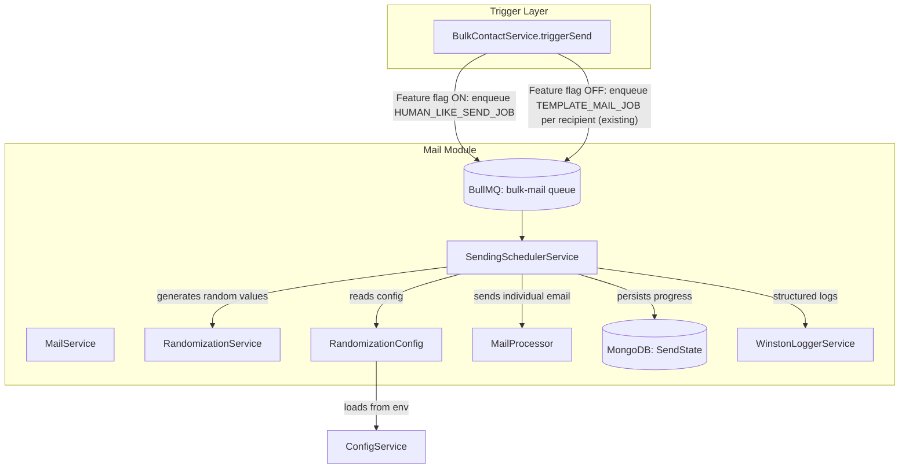
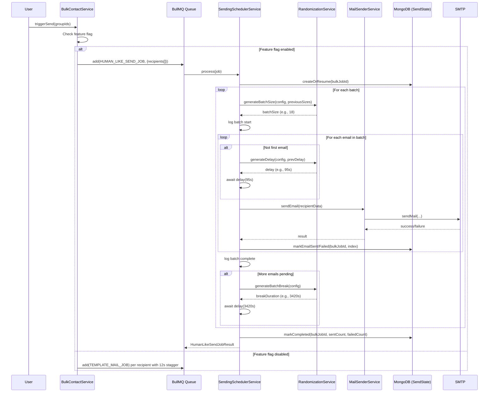
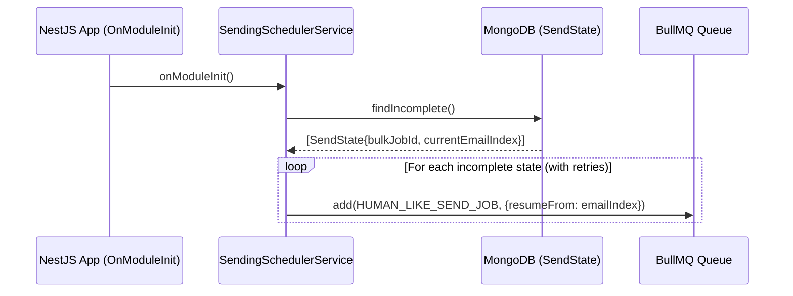
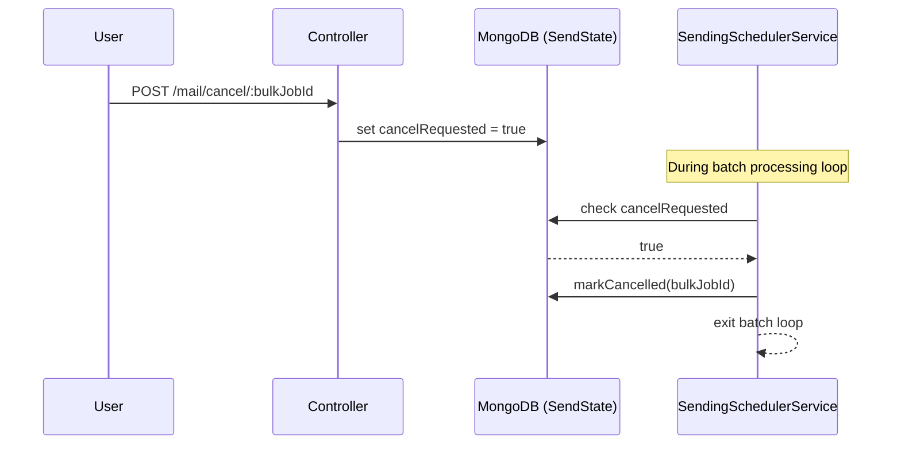

# Design Document: Human-Like Email Sending

## Overview

This design replaces the existing fixed-rate email sending pattern (12-second stagger delay per recipient via BullMQ `delay`) with a human-like randomized sending pattern. The new `SendingSchedulerService` sits between the bulk-contact trigger and the mail processor, orchestrating batch-based sending with randomized inter-email delays and batch breaks.

**Key design decisions:**
- **Single long-running BullMQ job per bulk send** instead of one job per recipient. The scheduler processes emails sequentially within a single worker job, using `setTimeout`-based async delays to avoid blocking the event loop.
- **MongoDB-backed state persistence** (`SendState` schema) enables crash recovery without duplicating emails.
- **Feature flag** allows instant rollback to the existing fixed-rate pattern without redeployment.
- **Pure randomization functions** are extracted into a testable `RandomizationService` so correctness properties can be verified via property-based testing.

## Architecture



### How It Fits Into the Existing System

1. **Entry point change**: `BulkContactService.triggerSend()` currently enqueues one `TEMPLATE_MAIL_JOB` per recipient with a fixed 12s stagger. When the feature flag is enabled, it instead enqueues a single `HUMAN_LIKE_SEND_JOB` containing all recipient data for the bulk job.
2. **New processor**: `SendingSchedulerService` extends `WorkerHost` and handles `HUMAN_LIKE_SEND_JOB`. It orchestrates the batch loop internally using async delays.
3. **Reuses existing mail sending**: Individual email sends still go through the same SMTP transporter logic in `MailProcessor.processTemplateEmail()` (extracted into a shared method), preserving retry logic, attachment resolution, and result storage.
4. **No changes to existing interfaces**: `TemplateMailJobData`, `BulkMailJobData`, and `BulkMailJobResult` remain unchanged. The new job type uses its own interface.

## Components and Interfaces

### 1. RandomizationService

Pure, stateless service responsible for all random value generation. Uses Node.js `crypto.randomInt()` for cryptographically secure randomness.

```typescript
@Injectable()
export class RandomizationService {
  /**
   * Generate a random integer in [min, max] inclusive using crypto.randomInt.
   */
  randomInt(min: number, max: number): number;

  /**
   * Generate a batch size within config bounds, respecting anti-pattern rules.
   * @param config - Randomization config with batch size bounds
   * @param previousBatchSizes - Array of recent batch sizes (up to 5)
   * @returns A batch size that passes anti-repeat checks
   */
  generateBatchSize(config: RandomizationConfig, previousBatchSizes: number[]): number;

  /**
   * Generate an inter-email delay with jitter applied.
   * @param config - Randomization config with delay and jitter bounds
   * @param previousDelay - The previous delay value (for consecutive check)
   * @returns Delay in seconds, clamped to minimum 30s
   */
  generateDelay(config: RandomizationConfig, previousDelay: number | null): number;

  /**
   * Generate a batch break duration with jitter applied.
   * @param config - Randomization config with break and jitter bounds
   * @returns Break duration in seconds, clamped to configured minimum
   */
  generateBatchBreak(config: RandomizationConfig): number;

  /**
   * Apply jitter to a base value.
   * @param baseValue - The base delay/break in seconds
   * @param jitterMin - Minimum jitter magnitude (seconds)
   * @param jitterMax - Maximum jitter magnitude (seconds)
   * @param clampMin - Minimum allowed final value (seconds)
   * @returns The jittered value, clamped to clampMin
   */
  applyJitter(baseValue: number, jitterMin: number, jitterMax: number, clampMin: number): number;
}
```

### 2. RandomizationConfig

Value object loaded from environment variables at startup.

```typescript
@Injectable()
export class RandomizationConfigService {
  private config: RandomizationConfig;

  constructor(private configService: ConfigService) {
    this.config = this.loadAndValidate();
  }

  /**
   * Load config from env vars, validate, and return.
   * Throws on invalid configuration at startup.
   */
  private loadAndValidate(): RandomizationConfig;

  getConfig(): RandomizationConfig;

  isEnabled(): boolean;
}
```

### 3. SendingSchedulerService

The orchestrator. Extends `WorkerHost` to process `HUMAN_LIKE_SEND_JOB` from BullMQ.

```typescript
@Processor(MAIL_QUEUE)
export class SendingSchedulerService extends WorkerHost {
  constructor(
    private readonly randomizationService: RandomizationService,
    private readonly configService: RandomizationConfigService,
    private readonly mailSender: MailSenderService, // extracted SMTP sending logic
    private readonly sendStateModel: Model<SendStateDocument>,
    private readonly logger: WinstonLoggerService,
  ) { super(); }

  async process(job: Job<HumanLikeSendJobData>): Promise<HumanLikeSendJobResult>;

  /**
   * Process a single batch of emails sequentially with random delays.
   */
  private async processBatch(
    job: Job<HumanLikeSendJobData>,
    emails: TemplateMailJobData[],
    batchNumber: number,
    state: SendStateDocument,
  ): Promise<{ sent: number; failed: number }>;

  /**
   * Async delay that does not block the event loop.
   */
  private delay(seconds: number): Promise<void>;

  /**
   * Resume from persisted state on restart.
   */
  private async resumeFromState(state: SendStateDocument): Promise<number>;

  /**
   * Check if cancellation has been requested.
   */
  private async isCancelled(jobId: string): Promise<boolean>;
}
```

### 4. SendState Repository

Handles MongoDB persistence of sending progress.

```typescript
@Injectable()
export class SendStateRepository {
  constructor(@InjectModel(SendState.name) private model: Model<SendStateDocument>) {}

  async createOrResume(bulkJobId: string, userId: string, totalEmails: number): Promise<SendStateDocument>;
  async markEmailSent(bulkJobId: string, emailIndex: number): Promise<void>;
  async markEmailFailed(bulkJobId: string, emailIndex: number, reason: string): Promise<void>;
  async updateBatchPosition(bulkJobId: string, batchNumber: number, emailIndex: number): Promise<void>;
  async markCompleted(bulkJobId: string, sentCount: number, failedCount: number): Promise<void>;
  async markCancelled(bulkJobId: string): Promise<void>;
  async findIncomplete(): Promise<SendStateDocument[]>;
  async findByBulkJobId(bulkJobId: string): Promise<SendStateDocument | null>;
}
```

### 5. Integration with Existing MailProcessor

The existing `MailProcessor` continues to handle `MAIL_JOB` and `TEMPLATE_MAIL_JOB` (for the fixed-rate path). The SMTP sending logic from `processTemplateEmail` is extracted into a shared `MailSenderService` that both the existing processor and the new scheduler can call.

```typescript
@Injectable()
export class MailSenderService {
  /**
   * Send a single email via SMTP with attachment resolution.
   * Reuses the pooled transporter.
   */
  async sendEmail(data: TemplateMailJobData): Promise<TemplateMailJobResult>;
}
```

## Data Models

### SendState (MongoDB Schema)

```typescript
@Schema({ timestamps: true, collection: 'send_states' })
export class SendState {
  @Prop({ required: true, index: true })
  bulkJobId: string;

  @Prop({ required: true, type: Types.ObjectId, ref: 'User' })
  userId: Types.ObjectId;

  @Prop({ required: true, enum: ['pending', 'in_progress', 'completed', 'cancelled', 'manual_intervention'] })
  status: string;

  @Prop({ required: true })
  totalEmails: number;

  @Prop({ default: 0 })
  sentCount: number;

  @Prop({ default: 0 })
  failedCount: number;

  @Prop({ default: 0 })
  currentBatch: number;

  @Prop({ default: 0 })
  currentEmailIndex: number;

  @Prop({ type: [Number], default: [] })
  previousBatchSizes: number[];

  @Prop({ type: [{ email: String, status: String, failureReason: String, sentAt: Date }], default: [] })
  emailResults: Array<{
    email: string;
    status: 'sent' | 'failed' | 'pending';
    failureReason?: string;
    sentAt?: Date;
  }>;

  @Prop()
  startedAt?: Date;

  @Prop()
  completedAt?: Date;

  @Prop({ default: false })
  cancelRequested: boolean;
}
```

### RandomizationConfig (Interface)

```typescript
export interface RandomizationConfig {
  batchSizeMin: number;      // default: 15
  batchSizeMax: number;      // default: 25
  delayMin: number;          // seconds, default: 60
  delayMax: number;          // seconds, default: 180
  breakMin: number;          // minutes, default: 45
  breakMax: number;          // minutes, default: 120
  jitterMin: number;         // seconds, default: 5
  jitterMax: number;         // seconds, default: 10
  enabled: boolean;          // default: false
}
```

### HumanLikeSendJobData (Job Payload)

```typescript
export const HUMAN_LIKE_SEND_JOB = 'human-like-send';

export interface HumanLikeSendJobData {
  userId: string;
  bulkJobId: string;
  recipients: Array<{
    groupId: string;
    recipientEmail: string;
    recipientName: string;
    subject: string;
    body: string;
    from?: string;
    resumeUrl?: string;
  }>;
}

export interface HumanLikeSendJobResult {
  bulkJobId: string;
  totalEmails: number;
  sentCount: number;
  failedCount: number;
  totalBatches: number;
  elapsedSeconds: number;
  status: 'completed' | 'cancelled';
}
```

## Sequence Diagrams

### Main Sending Flow



### Restart Recovery Flow



### Cancellation Flow



## Algorithm Details

### Batch Size Generation with Anti-Pattern Detection

```
function generateBatchSize(config, previousBatchSizes):
    for attempt = 1 to 10:
        candidate = crypto.randomInt(config.batchSizeMin, config.batchSizeMax + 1)
        
        // Check: not same as previous 2 consecutive (Req 4.1)
        if previousBatchSizes.length >= 2:
            last2 = previousBatchSizes.slice(-2)
            if last2[0] === last2[1] === candidate:
                continue  // regenerate
        
        // Check: no repeated subsequence of length >= 2 in window of 5 (Req 4.3)
        testSequence = [...previousBatchSizes.slice(-4), candidate]  // window of 5
        if hasRepeatedSubsequence(testSequence):
            continue  // regenerate
        
        return candidate
    
    // Exhausted attempts — offset by 1 (Req 4.5)
    fallback = candidate + 1
    if fallback > config.batchSizeMax:
        fallback = candidate - 1
    return clamp(fallback, config.batchSizeMin, config.batchSizeMax)
```

### Delay Generation with Jitter and Consecutive Check

```
function generateDelay(config, previousDelay):
    for attempt = 1 to 10:
        base = crypto.randomInt(config.delayMin, config.delayMax + 1)
        jittered = applyJitter(base, config.jitterMin, config.jitterMax, clampMin=30)
        
        // Check: not within 1 second of previous (Req 2.4)
        if previousDelay !== null AND abs(jittered - previousDelay) <= 1:
            continue  // regenerate
        
        return jittered
    
    // Exhausted attempts — use last value offset by 2 seconds
    return max(30, jittered + 2)

function applyJitter(baseValue, jitterMin, jitterMax, clampMin):
    magnitude = crypto.randomInt(jitterMin, jitterMax + 1)
    sign = crypto.randomInt(0, 2) === 0 ? -1 : 1
    result = baseValue + (sign * magnitude)
    return max(clampMin, result)
```

### Repeated Subsequence Detection

```
function hasRepeatedSubsequence(sequence):  // sequence length <= 5
    // Extract all subsequences of length 2, 3, 4 (contiguous)
    for length = 2 to floor(sequence.length / 2):
        seen = new Set()
        for i = 0 to sequence.length - length:
            sub = sequence.slice(i, i + length).join(',')
            if seen.has(sub):
                return true
            seen.add(sub)
    return false
```

## Correctness Properties

*A property is a characteristic or behavior that should hold true across all valid executions of a system — essentially, a formal statement about what the system should do. Properties serve as the bridge between human-readable specifications and machine-verifiable correctness guarantees.*

### Property 1: Batch size generation stays within configured bounds

*For any* valid `RandomizationConfig` where `batchSizeMin < batchSizeMax` and both are positive integers within [1, 1000], the `generateBatchSize` function SHALL always return a value `v` such that `batchSizeMin <= v <= batchSizeMax`.

**Validates: Requirements 1.1, 5.2**

### Property 2: Inter-email delay with jitter stays in valid range

*For any* valid `RandomizationConfig` where `delayMin < delayMax` and both are positive integers, and for any `previousDelay` value (or null), the `generateDelay` function SHALL always return a value `d` such that `d >= 30` (the absolute minimum clamp).

**Validates: Requirements 2.1, 2.3**

### Property 3: Batch break duration with jitter is clamped to configured minimum

*For any* valid `RandomizationConfig` where `breakMin < breakMax` and both are positive integers, the `generateBatchBreak` function SHALL always return a value `b` such that `b >= breakMin * 60` (converted to seconds).

**Validates: Requirements 3.1, 3.3, 3.4**

### Property 4: No two consecutive delays are within 1 second of each other

*For any* sequence of delays generated by calling `generateDelay` repeatedly with the same config and passing each result as `previousDelay` to the next call, no two consecutive values `d[i]` and `d[i+1]` SHALL satisfy `|d[i] - d[i+1]| <= 1`.

**Validates: Requirements 2.4, 4.2**

### Property 5: No three consecutive batch sizes are identical

*For any* sequence of batch sizes generated by calling `generateBatchSize` repeatedly while passing the accumulating `previousBatchSizes` array, no three consecutive values `s[i]`, `s[i+1]`, `s[i+2]` SHALL all be equal.

**Validates: Requirements 4.1**

### Property 6: No repeated contiguous subsequence in batch size window

*For any* window of 5 consecutive batch sizes generated by the scheduler, no contiguous subsequence of length >= 2 SHALL appear more than once within that window.

**Validates: Requirements 4.3**

### Property 7: All emails in a batch are attempted regardless of individual failures

*For any* batch of `n` emails where each email independently succeeds or fails, the `processBatch` function SHALL attempt exactly `n` sends, and the sum of `sent + failed` in the returned result SHALL equal `n`.

**Validates: Requirements 1.3, 5.4**

### Property 8: Final Send_State correctly tallies sent and failed counts

*For any* complete execution of a bulk job with `totalEmails` recipients, after the job completes, the Send_State SHALL satisfy `sentCount + failedCount == totalEmails` and `status == 'completed'`.

**Validates: Requirements 5.7**

### Property 9: Configuration validation accepts valid configs and rejects invalid ones

*For any* pair of integers `(min, max)` representing a config parameter: if `min > 0` AND `max > 0` AND `min < max` AND both are within absolute bounds [1, 1000] (for batch size) or [1, 3600] (for delays) or [1, 1440] (for breaks) or [1, 60] (for jitter), then the config SHALL be accepted. Otherwise, it SHALL be rejected with an appropriate error.

**Validates: Requirements 8.1, 8.2, 8.3, 8.4, 8.7, 8.8**

## Error Handling

| Scenario | Handling Strategy |
|----------|-------------------|
| Individual email SMTP failure | Record failure in SendState, skip email, continue batch (Req 5.4) |
| SendState MongoDB persistence failure | Retry 3 times with 1s intervals. If all retries fail, halt batch and log error (Req 7.3) |
| MongoDB unavailable on restart | Retry loading state 5 times with 5s intervals. Mark job as `manual_intervention` if all fail (Req 7.5) |
| Invalid RandomizationConfig at startup | Throw error during module initialization, preventing app from starting (Req 8.7, 8.8) |
| SMTP transporter creation failure | Propagate error to job, triggering BullMQ's retry with exponential backoff (existing behavior) |
| Cancellation requested mid-batch | Complete current email send, then stop. Mark state as `cancelled` (Req 5.8) |
| Anti-pattern regeneration exhausted (10 attempts) | Use last value offset by ±1 within bounds (Req 4.5) |
| Queue contains > 500 emails for a job | Process only first 500 (Req 5.1) |

### Retry Strategy

- **Email sends**: 3 attempts with exponential backoff (5s base) — inherited from existing BullMQ job config
- **State persistence**: 3 retries × 1s interval — new, handles transient MongoDB issues
- **Restart recovery**: 5 retries × 5s interval — new, handles MongoDB startup delays

## Testing Strategy

### Property-Based Tests (fast-check)

The project already includes `fast-check` as a dependency. Property tests will target the pure `RandomizationService` functions.

- **Library**: fast-check (already in package.json)
- **Minimum iterations**: 100 per property
- **Tag format**: `Feature: human-like-email-sending, Property {N}: {description}`
- **Files**: `backend/src/mail/randomization.service.pbt.spec.ts`, `backend/src/mail/sending-scheduler.pbt.spec.ts`

Properties to test:
1. Batch size bounds (Property 1)
2. Delay minimum clamp (Property 2)
3. Break duration minimum clamp (Property 3)
4. Consecutive delay separation (Property 4)
5. No triple-repeat batch sizes (Property 5)
6. No repeated subsequence in window (Property 6)
7. Batch attempt completeness (Property 7)
8. Final state tally correctness (Property 8)
9. Config validation (Property 9)

### Unit Tests (Jest)

- `RandomizationConfigService`: startup validation, env var loading, defaults
- `SendingSchedulerService`: batch loop logic, cancellation, empty queue handling
- `SendStateRepository`: CRUD operations, state transitions
- Feature flag toggling behavior
- Edge cases: queue with 1 email, batch size = 1, delay at boundary values

### Integration Tests

- Full send flow with mocked SMTP (verify emails sent in correct order with delays)
- Restart recovery with seeded MongoDB state
- BullMQ job enqueue/dequeue with correct payload structure
- Logger call verification (correct metadata at each lifecycle point)
