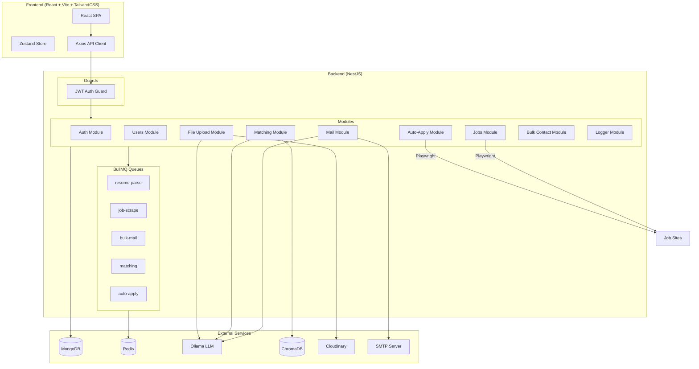
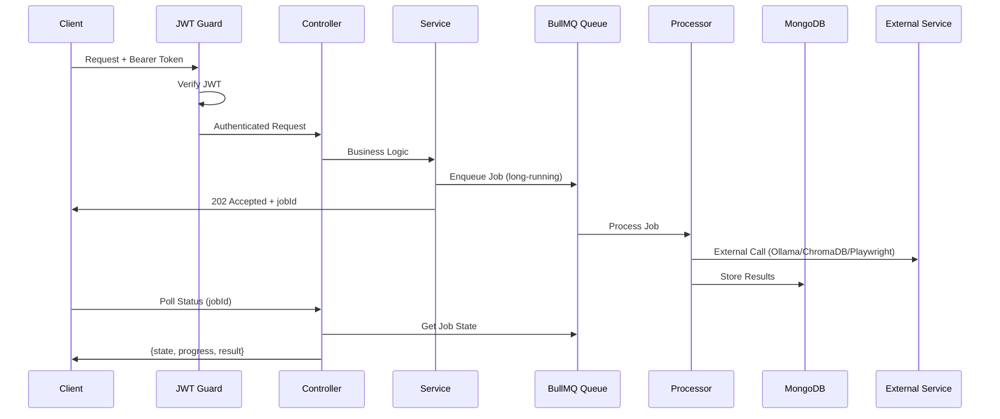
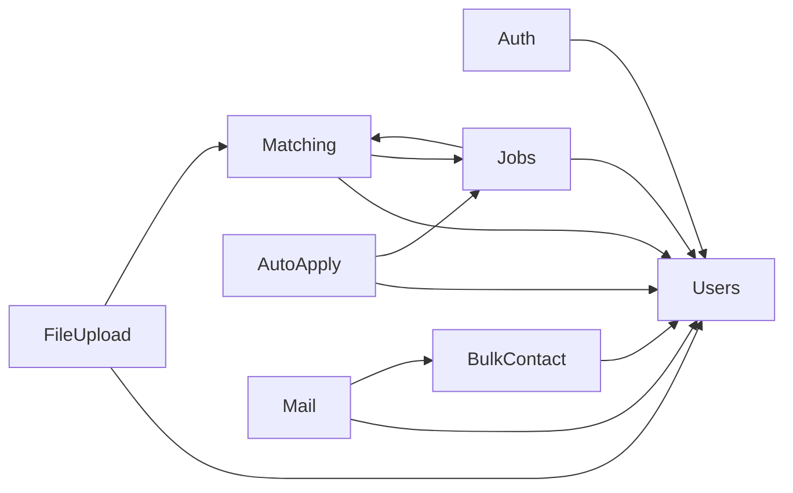

# Design Document: JobFinder AI System

## Overview

The JobFinder AI System is a full-stack intelligent job search platform that automates the job-hunting lifecycle: from resume parsing to job discovery, AI-powered matching, automated applications, and recruiter outreach. The system is built on a NestJS modular backend, a React/Vite frontend, and integrates MongoDB, Redis/BullMQ, Ollama (local LLM), ChromaDB (vector DB), and Playwright (browser automation).

This design covers the complete system architecture including four major new modules (Auth, Matching, Auto-Apply, Bulk Contact) and enhancements to existing modules (Mail, Jobs, Users, Frontend).

### Key Design Decisions

1. **Extend, don't rewrite**: All new features are additive NestJS modules that integrate with existing infrastructure (BullMQ, MongoDB, Ollama patterns).
2. **JWT with refresh token rotation**: Stateful refresh tokens stored in MongoDB enable revocation and account lockout.
3. **RAG via ChromaDB + Ollama embeddings**: Vector similarity search combined with keyword overlap for hybrid scoring (70/30 split).
4. **Playwright reuse**: Auto-apply leverages the existing `browser.helper.ts` patterns from the scraping module.
5. **Rate limiting at queue level**: BullMQ job options enforce rate limits for email sending (5/min) and auto-apply (10/hr/platform).

---

## Architecture

### System Architecture Diagram



### Request Flow



### Module Dependency Graph



---

## Components and Interfaces

### 1. Auth Module (`backend/src/auth/`)

**Purpose**: JWT-based authentication with access/refresh token rotation, bcrypt password hashing, account lockout, and global route protection.

#### Files
- `auth.module.ts` — Module registration
- `auth.controller.ts` — Login, register, refresh, logout endpoints
- `auth.service.ts` — Token generation, validation, password hashing, lockout logic
- `jwt.strategy.ts` — Passport JWT strategy for token extraction
- `jwt-auth.guard.ts` — Global guard (excludes public routes)
- `public.decorator.ts` — `@Public()` decorator to skip auth on specific routes
- `dto/register.dto.ts` — Registration DTO (name, email, password)
- `dto/login.dto.ts` — Login DTO (email, password)
- `dto/refresh-token.dto.ts` — Refresh token DTO

#### API Endpoints

| Method | Path | Auth | Description |
|--------|------|------|-------------|
| POST | `/auth/register` | Public | Create account with password |
| POST | `/auth/login` | Public | Authenticate, return tokens |
| POST | `/auth/refresh` | Public | Rotate tokens |
| POST | `/auth/logout` | Protected | Revoke refresh token |
| GET | `/auth/me` | Protected | Get current user from token |

#### Key Interfaces

```typescript
interface TokenPayload {
  sub: string;      // userId
  email: string;
  iat: number;
  exp: number;
}

interface AuthTokens {
  accessToken: string;   // JWT, 15min expiry
  refreshToken: string;  // opaque, 7-day expiry
}

interface RefreshTokenEntry {
  token: string;         // hashed refresh token
  expiresAt: Date;
  createdAt: Date;
  revoked: boolean;
}
```

---

### 2. Matching Module (`backend/src/matching/`)

**Purpose**: RAG-based job-resume matching using Ollama embeddings stored in ChromaDB, with hybrid scoring (70% cosine similarity + 30% keyword overlap).

#### Files
- `matching.module.ts` — Module registration
- `matching.controller.ts` — Score retrieval, recompute trigger
- `matching.service.ts` — Score computation orchestration
- `embedding.service.ts` — Ollama embedding generation + ChromaDB CRUD
- `score-calculator.ts` — Pure scoring logic (cosine + skill overlap)
- `matching.processor.ts` — BullMQ processor for batch embedding/scoring
- `match-score.schema.ts` — MongoDB schema for cached scores
- `dto/match-query.dto.ts` — Query parameters for score retrieval

#### API Endpoints

| Method | Path | Auth | Description |
|--------|------|------|-------------|
| GET | `/matching/scores/:userId` | Protected | Get cached match scores for user's jobs |
| POST | `/matching/recompute/:userId` | Protected | Force recompute all scores |
| GET | `/matching/status/:jobId` | Protected | Poll matching job status |

#### Key Interfaces

```typescript
interface MatchScore {
  userId: string;
  jobId: string;
  cosineSimilarity: number;   // 0-1 from ChromaDB
  skillOverlap: number;       // 0-1 ratio
  finalScore: number;         // 0-100 (70*cosine + 30*skillOverlap) * 100
  degraded: boolean;          // true if fallback to keyword-only
  computedAt: Date;
}

interface EmbeddingRequest {
  text: string;
  id: string;              // userId or jobId
  collection: 'profiles' | 'jobs';
}

interface BatchEmbeddingJob {
  userId: string;
  jobIds: string[];        // max 50 per batch
  type: 'jobs' | 'profile';
}
```

#### Score Calculation (Pure Function)

```typescript
function computeMatchScore(
  cosineSimilarity: number,  // 0-1
  resumeSkills: string[],
  jobKeywords: string[],
): { finalScore: number; skillOverlap: number } {
  const matchedSkills = resumeSkills.filter(skill =>
    jobKeywords.some(kw => kw.toLowerCase() === skill.toLowerCase())
  );
  const skillOverlap = resumeSkills.length > 0
    ? matchedSkills.length / resumeSkills.length
    : 0;
  const finalScore = Math.round((0.7 * cosineSimilarity + 0.3 * skillOverlap) * 100);
  return { finalScore: Math.min(100, Math.max(0, finalScore)), skillOverlap };
}
```

---

### 3. Auto-Apply Module (`backend/src/auto-apply/`)

**Purpose**: Playwright-based automated job application with form detection, auto-fill, CAPTCHA detection, and application tracking.

#### Files
- `auto-apply.module.ts` — Module registration
- `auto-apply.controller.ts` — Trigger apply, batch apply, status, list applications
- `auto-apply.service.ts` — Job enqueueing, rate limit checks
- `auto-apply.processor.ts` — BullMQ processor (Playwright automation)
- `form-filler.ts` — Form field detection and auto-fill logic
- `confirmation-detector.ts` — Submission success detection
- `application.schema.ts` — Application tracker schema
- `application.repository.ts` — MongoDB operations
- `dto/trigger-apply.dto.ts` — Single apply DTO
- `dto/batch-apply.dto.ts` — Batch apply DTO (max 50 jobs)

#### API Endpoints

| Method | Path | Auth | Description |
|--------|------|------|-------------|
| POST | `/applications/apply` | Protected | Auto-apply to single job |
| POST | `/applications/batch-apply` | Protected | Auto-apply to up to 50 jobs |
| GET | `/applications/status/:jobId` | Protected | Poll auto-apply job status |
| GET | `/applications/:userId` | Protected | List all tracked applications |
| GET | `/applications/:userId/stats` | Protected | Application statistics |

#### Key Interfaces

```typescript
interface Application {
  userId: string;
  jobId: string;
  status: 'pending' | 'applied' | 'failed' | 'requires_manual_action';
  appliedAt?: Date;
  failureReason?: string;
  skippedFields?: SkippedField[];
  platform: string;
}

interface SkippedField {
  fieldIdentifier: string;  // label, name, or placeholder
  reason: 'requires_manual_review';
}

interface FormFieldMapping {
  fieldSelector: string;
  profileField: keyof UserProfile | 'name' | 'email';
  matchedBy: 'label' | 'name' | 'placeholder';
}

interface AutoApplyJob {
  userId: string;
  jobId: string;
  applyUrl: string;
  profileData: UserProfile & { name: string; email: string };
  resumeUrl?: string;
}
```

#### Form Field Detection Logic

```typescript
const FIELD_MAPPINGS: Record<string, string[]> = {
  name: ['name', 'full name', 'your name', 'applicant name'],
  email: ['email', 'e-mail', 'email address'],
  phone: ['phone', 'mobile', 'telephone', 'contact number'],
  linkedin: ['linkedin', 'linkedin url', 'linkedin profile'],
  resume: ['resume', 'cv', 'upload resume', 'attach resume'],
};
```

---

### 4. Bulk Contact Module (`backend/src/bulk-contact/`)

**Purpose**: Contact file parsing (PDF/DOC/CSV), grouping by title/company, AI template generation per group, dynamic personalization, and integration with the mail module for bulk sending.

#### Files
- `bulk-contact.module.ts` — Module registration
- `bulk-contact.controller.ts` — Upload, group, preview, trigger send
- `bulk-contact.service.ts` — Orchestration logic
- `contact-parser.service.ts` — File parsing (CSV, PDF, DOC/DOCX)
- `grouping.service.ts` — Contact grouping logic
- `template-generator.service.ts` — Ollama-powered template generation
- `personalization.service.ts` — Placeholder replacement
- `bulk-contact.schema.ts` — BulkContact collection schema
- `contact-group.schema.ts` — Group metadata schema
- `email-template.schema.ts` — Cached template schema
- `dto/upload-contacts.dto.ts` — Upload DTO
- `dto/group-contacts.dto.ts` — Grouping DTO
- `dto/trigger-bulk-send.dto.ts` — Send trigger DTO

#### API Endpoints

| Method | Path | Auth | Description |
|--------|------|------|-------------|
| POST | `/contacts/upload` | Protected | Upload contact file (PDF/DOC/CSV) |
| POST | `/contacts/group` | Protected | Group contacts by title or company |
| GET | `/contacts/groups/:userId` | Protected | Get grouped contacts |
| POST | `/contacts/generate-templates` | Protected | Generate AI templates per group |
| PATCH | `/contacts/templates/:groupId` | Protected | Edit template before send |
| POST | `/contacts/send` | Protected | Trigger bulk send |
| GET | `/contacts/send/status/:jobId` | Protected | Poll send job status |

#### Key Interfaces

```typescript
interface BulkContact {
  userId: string;
  name: string;
  email: string;
  title?: string;
  company?: string;
  sourceFile: string;
  uploadedAt: Date;
}

interface ContactGroup {
  userId: string;
  groupType: 'title' | 'company';
  groupValue: string;
  contactIds: string[];
  templateId?: string;
}

interface EmailTemplate {
  groupId: string;
  userId: string;
  subject: string;       // max 200 chars
  body: string;          // max 2000 chars
  generatedBy: 'ai' | 'manual';
  cachedAt: Date;
}

interface PersonalizedEmail {
  to: string;
  subject: string;
  body: string;
  attachmentUrl: string;
}

// Template personalization
function personalizeTemplate(
  template: { subject: string; body: string },
  recipient: { name: string; company?: string; title?: string },
): { subject: string; body: string } {
  const replace = (text: string) => text
    .replace(/\{\{name\}\}/gi, recipient.name)
    .replace(/\{\{company\}\}/gi, recipient.company ?? '')
    .replace(/\{\{title\}\}/gi, recipient.title ?? '');
  return { subject: replace(template.subject), body: replace(template.body) };
}
```

---

### 5. Enhanced Mail Module (extensions to `backend/src/mail/`)

**Purpose**: Extended to support AI-generated templates, rate-limited sending (5/min), and per-recipient result tracking.

#### New/Modified Files
- `mail.service.ts` — Add rate-limited bulk send with template injection
- `mail.processor.ts` — Add rate limiting via BullMQ limiter config
- `mail-result.schema.ts` — Per-recipient send result tracking

#### Rate Limiting Configuration

```typescript
// BullMQ queue options for mail
{
  limiter: {
    max: 5,
    duration: 60_000, // 5 per minute
  }
}
```

---

### 6. User Schema Extensions

New fields added to the existing User schema:

```typescript
// Added to User schema
@Prop()
password?: string;  // bcrypt hashed

@Prop({ type: [Object], default: [] })
refreshTokens: RefreshTokenEntry[];

@Prop({ default: 0 })
failedLoginAttempts: number;

@Prop()
accountLockedUntil?: Date;
```

---

### 7. Frontend Architecture Updates

#### New Pages/Routes
- `/auth/login` — Login form
- `/auth/register` — Registration form (enhanced with password)
- `/dashboard/applications` — Application tracker
- `/dashboard/contacts` — Bulk contact management
- `/dashboard/matching` — Job matching scores view

#### Auth Flow (Frontend)

```typescript
// Token management in Zustand store
interface AuthState {
  accessToken: string | null;
  user: User | null;
  setTokens: (access: string) => void;
  clearAuth: () => void;
}

// Axios interceptor for auto-refresh
axiosInstance.interceptors.response.use(
  response => response,
  async (error) => {
    if (error.response?.status === 401 && !error.config._retry) {
      error.config._retry = true;
      const { data } = await axios.post('/auth/refresh', {}, { withCredentials: true });
      useAuthStore.getState().setTokens(data.accessToken);
      error.config.headers.Authorization = `Bearer ${data.accessToken}`;
      return axiosInstance(error.config);
    }
    return Promise.reject(error);
  }
);
```

---

## Data Models

### MongoDB Collections

#### Users Collection (extended)

```typescript
{
  _id: ObjectId,
  name: string,
  email: string,              // unique
  password: string,           // bcrypt hash (NEW)
  refreshTokens: [{           // (NEW)
    token: string,            // hashed
    expiresAt: Date,
    createdAt: Date,
    revoked: boolean,
  }],
  failedLoginAttempts: number, // (NEW)
  accountLockedUntil: Date,    // (NEW)
  resume: Object,
  resumeRawText: string,
  resumeCloudinaryUrl: string,
  resumeCloudinaryId: string,
  resumeVersions: Object[],
  profile: UserProfile,
  createdAt: Date,
  updatedAt: Date,
}
```

#### Jobs Collection (existing, extended with matching)

```typescript
{
  _id: ObjectId,
  title: string,
  company: string,
  location: string,
  jd: string,
  contactEmail: string,
  applyUrl: string,
  scrapeUrl: string,
  source: 'indeed' | 'naukri' | 'internshala' | 'jsearch' | 'google' | 'company',
  scrapedAt: Date,
  postedAt: string,
  postedAtDate: Date,
  dedupeHash: string,         // unique, SHA-256
  matchedSkills: string[],
  targetCompany: string,
  queryKeywords: string[],
  flagged: boolean,
  flagReason: string,
  // No changes to job schema — scores stored separately
}
```

#### Match Scores Collection (NEW)

```typescript
{
  _id: ObjectId,
  userId: ObjectId,           // ref: users
  jobId: ObjectId,            // ref: jobs
  cosineSimilarity: number,   // 0-1
  skillOverlap: number,       // 0-1
  finalScore: number,         // 0-100
  degraded: boolean,
  computedAt: Date,
}
// Indexes: { userId: 1, jobId: 1 } unique, { userId: 1, finalScore: -1 }
```

#### Applications Collection (NEW)

```typescript
{
  _id: ObjectId,
  userId: ObjectId,           // ref: users
  jobId: ObjectId,            // ref: jobs
  status: 'pending' | 'applied' | 'failed' | 'requires_manual_action',
  platform: string,           // e.g., 'indeed', 'naukri'
  appliedAt: Date,
  failureReason: string,
  skippedFields: [{
    fieldIdentifier: string,
    reason: string,
  }],
  createdAt: Date,
  updatedAt: Date,
}
// Indexes: { userId: 1, status: 1 }, { userId: 1, createdAt: -1 }
```

#### Bulk Contacts Collection (NEW)

```typescript
{
  _id: ObjectId,
  userId: ObjectId,           // ref: users
  name: string,
  email: string,
  title: string,
  company: string,
  sourceFile: string,         // filename
  uploadedAt: Date,
}
// Indexes: { userId: 1 }, { userId: 1, email: 1 } unique
```

#### Contact Groups Collection (NEW)

```typescript
{
  _id: ObjectId,
  userId: ObjectId,
  groupType: 'title' | 'company',
  groupValue: string,
  contactIds: ObjectId[],     // refs: bulk_contacts
  templateId: ObjectId,       // ref: email_templates
  createdAt: Date,
}
// Indexes: { userId: 1, groupType: 1, groupValue: 1 }
```

#### Email Templates Collection (NEW)

```typescript
{
  _id: ObjectId,
  groupId: ObjectId,          // ref: contact_groups
  userId: ObjectId,
  subject: string,            // max 200 chars
  body: string,               // max 2000 chars
  generatedBy: 'ai' | 'manual',
  cachedAt: Date,
}
// Indexes: { groupId: 1 } unique
```

#### Mail Results Collection (NEW)

```typescript
{
  _id: ObjectId,
  userId: ObjectId,
  bulkJobId: string,          // BullMQ job ID
  groupId: ObjectId,
  recipientEmail: string,
  recipientName: string,
  status: 'sent' | 'failed',
  failureReason: string,
  sentAt: Date,
}
// Indexes: { userId: 1, bulkJobId: 1 }, { userId: 1, sentAt: -1 }
```

### ChromaDB Collections

```
profiles/     — User profile embeddings (one per user)
  id: userId
  embedding: float[]
  metadata: { userId, skills, lastUpdated }

jobs/         — Job description embeddings (one per job)
  id: jobId
  embedding: float[]
  metadata: { jobId, title, company, skills }
```

### BullMQ Queues

| Queue Name | Purpose | Concurrency | Rate Limit |
|-----------|---------|-------------|------------|
| `resume-parse` | LLM resume parsing | 2 | None |
| `job-scrape` | Multi-source scraping | 1 | None |
| `bulk-mail` | Email sending | 1 | 5/min |
| `matching` | Embedding + score compute | 2 | None |
| `auto-apply` | Playwright form fill | 1 | 10/hr/platform |

---

## Correctness Properties

*A property is a characteristic or behavior that should hold true across all valid executions of a system — essentially, a formal statement about what the system should do. Properties serve as the bridge between human-readable specifications and machine-verifiable correctness guarantees.*

### Property 1: Input validation correctness

*For any* string, the name validator SHALL accept it if and only if its length is between 2 and 100 characters inclusive, and the email validator SHALL accept it if and only if it matches the pattern `local@domain.tld` with no whitespace.

**Validates: Requirements 1.3**

### Property 2: File upload validation

*For any* uploaded file, the file validator SHALL reject it if and only if the file is not a PDF or exceeds 10MB in size. Valid PDFs ≤ 10MB SHALL always be accepted.

**Validates: Requirements 2.3**

### Property 3: Resume text truncation

*For any* raw text string, the enqueue function SHALL pass text truncated to at most 6000 characters. If the input is ≤ 6000 characters, the output SHALL equal the input.

**Validates: Requirements 3.1**

### Property 4: Partial profile update preserves unmodified fields

*For any* existing user profile and any subset of valid profile fields submitted via PATCH, the resulting profile SHALL contain the new values for submitted fields and preserve the original values for all non-submitted fields. Fields with invalid email format or string length > 800 characters SHALL cause rejection.

**Validates: Requirements 4.3, 4.4**

### Property 5: Resume re-parse preserves manually edited fields

*For any* user profile where some fields have `lastUpdatedFrom = "manual"`, re-parsing the resume SHALL update only fields where `lastUpdatedFrom != "manual"`, leaving all manually-edited fields unchanged.

**Validates: Requirements 4.6**

### Property 6: Deduplication hash determinism and case-insensitivity

*For any* title and company string pair, `buildDedupeHash(title, company)` SHALL produce the same output regardless of case variations. Furthermore, `buildDedupeHash(a, b) === buildDedupeHash(c, d)` if and only if `a.toLowerCase().trim() === c.toLowerCase().trim()` and `b.toLowerCase().trim() === d.toLowerCase().trim()`.

**Validates: Requirements 5.4**

### Property 7: Relative date string parsing

*For any* relative date string of the form "N {minutes|hours|days|weeks|months} ago", `parsePostedAtDate` SHALL return a Date that is within an acceptable tolerance (±1 minute) of `now - N*unit`. For "today"/"just posted" it SHALL return a Date within 1 minute of now. For unparseable strings it SHALL return undefined.

**Validates: Requirements 5.7**

### Property 8: Job query correctness (filtering + sorting + pagination)

*For any* set of jobs in the database and any valid query parameters (page size 1-200, source filter, experience level, keywords, sort field), the returned results SHALL: (a) contain at most `pageSize` items, (b) include only jobs matching all applied filters, and (c) be ordered according to the specified sort field in descending order.

**Validates: Requirements 6.1, 6.2, 6.4**

### Property 9: Contact file parsing round-trip (CSV)

*For any* valid CSV file containing contact records with name, email, title, and company columns, parsing the file SHALL produce records whose field values exactly match the original input data (trimmed of surrounding whitespace).

**Validates: Requirements 7.1**

### Property 10: Contact list sanitization

*For any* list of parsed contact records, the sanitization function SHALL: (a) exclude all records missing a name or email field, (b) exclude all records with invalid email format, (c) remove duplicate email addresses keeping the first occurrence, and (d) the resulting list SHALL contain no duplicates and no invalid entries.

**Validates: Requirements 7.1**

### Property 11: Contact grouping correctness

*For any* list of contacts and any grouping mode (title or company), every contact in a group SHALL have the same value for the grouping field, and the union of all groups SHALL equal the complete contact list (no contacts lost or duplicated).

**Validates: Requirements 7.1**

### Property 12: Template personalization replaces all placeholders

*For any* email template containing `{{name}}`, `{{company}}`, and/or `{{title}}` placeholders, and any recipient with non-empty values for those fields, the personalized output SHALL contain zero remaining placeholder tokens and SHALL contain the recipient's actual values in the positions where placeholders were.

**Validates: Requirements 7.1**

### Property 13: Bulk send result aggregation

*For any* set of per-recipient send outcomes (each either "sent" or "failed"), the aggregated result SHALL satisfy: `total = successCount + failedCount`, `successCount` equals the number of "sent" outcomes, and `failedCount` equals the number of "failed" outcomes.

**Validates: Requirements 7.1**

### Property 14: Cache cleanup by age threshold

*For any* set of jobs with various `scrapedAt` timestamps and any `days` parameter (1-365), the cleanup function SHALL delete exactly those jobs where `now - scrapedAt > days * 86400000 ms` and leave all newer jobs intact.

**Validates: Requirements 8.4**

### Property 15: Log entry structure

*For any* log call with any message and context, the produced log entry SHALL contain: an ISO 8601 timestamp, the log level, the context label, and the original message.

**Validates: Requirements 10.2**

### Property 16: JWT token round-trip

*For any* valid user (with userId and email), signing an access token and then verifying it SHALL extract the same userId and email. For any expired token (issued > 15 minutes ago) or any malformed string, verification SHALL throw/reject.

**Validates: Requirements 11.1, 11.2, 11.4, 11.5**

### Property 17: Match_Score computation

*For any* cosine similarity value in [0, 1] and any pair of (resumeSkills, jobKeywords) arrays, the computed Match_Score SHALL equal `round((0.7 * cosineSimilarity + 0.3 * skillOverlapRatio) * 100)` clamped to [0, 100], where skillOverlapRatio is the count of case-insensitive exact matches divided by the number of resume skills (or 0 if resume has no skills).

**Validates: Requirements 12.4**

### Property 18: Match_Score ranking

*For any* set of jobs with computed Match_Scores, ranking by score descending SHALL produce a sequence where each score is ≥ the next score in the list.

**Validates: Requirements 12.5**

### Property 19: Embedding batch sizing

*For any* number of jobs N to embed, the batch processor SHALL split them into ceil(N/50) batches each containing at most 50 items, and the total items across all batches SHALL equal N.

**Validates: Requirements 12.12**

### Property 20: Form field mapping

*For any* HTML form field with a label, name attribute, or placeholder attribute, the form-filler SHALL map it to the correct profile field if the attribute text matches a known mapping keyword (case-insensitive), or mark it as "requires manual review" if no mapping is found.

**Validates: Requirements 13.2**

### Property 21: Rate limiting enforcement (auto-apply)

*For any* sequence of auto-apply requests to the same platform, the rate limiter SHALL allow at most 10 applications to be processed per 60-minute rolling window per platform. Excess requests SHALL be queued, not dropped.

**Validates: Requirements 13.11**

---

## Error Handling

### Strategy by Layer

| Layer | Strategy | Implementation |
|-------|----------|---------------|
| Controller | Validate DTOs, return appropriate HTTP codes | `class-validator` + NestJS exception filters |
| Service | Throw domain-specific exceptions | Custom exception classes extending `HttpException` |
| Processor (BullMQ) | Retry with backoff, then mark failed | BullMQ `attempts` + `backoff` config |
| External Service | Timeout + retry + fallback | Axios timeout, try/catch with retry logic |

### Error Categories

1. **Validation Errors (400)**: Invalid input, missing required fields, constraint violations
2. **Authentication Errors (401)**: Invalid/expired tokens, locked accounts
3. **Authorization Errors (403)**: Accessing another user's data
4. **Not Found (404)**: Non-existent resources (job ID, user ID)
5. **External Service Errors (502/503)**: Ollama down, ChromaDB unreachable, SMTP failure

### Fallback Chains

```
Ollama Embedding → retry 3x (5s delay) → keyword-only matching (degraded flag)
ChromaDB Query → fallback to keyword matching (degraded flag)
Playwright Launch → retry once (5s delay) → mark application as failed
SMTP Send → per-recipient failure tracking (partial success)
Ollama Email Gen → fallback to manual template input
```

### BullMQ Retry Configuration

```typescript
// Default for most queues
{ attempts: 3, backoff: { type: 'exponential', delay: 5000 } }

// Job scraping
{ attempts: 2, backoff: { type: 'fixed', delay: 5000 } }

// Auto-apply (no retry on form-fill failures)
{ attempts: 1 }  // Browser launch gets manual retry in code
```

---

## Testing Strategy

### Test Framework

- **Backend**: Jest (already configured)
- **Frontend**: Vitest (to be added)
- **Property-based testing**: `fast-check` (JavaScript PBT library)
- **E2E**: Supertest (backend API), Playwright (frontend if needed)

### Testing Pyramid

```
         ┌─────────┐
         │  E2E    │  ← 5-10 critical paths
         ├─────────┤
         │ Integr. │  ← API tests with real DB
         ├─────────┤
         │  Unit   │  ← Pure functions, services with mocks
         ├─────────┤
         │Property │  ← Universal properties (100+ iterations)
         └─────────┘
```

### Property-Based Tests (fast-check)

Each correctness property maps to a single property-based test running minimum 100 iterations:

| Property | Target Function | Generator Strategy |
|----------|----------------|-------------------|
| P1: Input validation | `validateName()`, `validateEmail()` | `fc.string()`, `fc.emailAddress()` |
| P2: File validation | `validateUpload()` | `fc.record({ size: fc.nat(), type: fc.string() })` |
| P3: Text truncation | `truncateText()` | `fc.string({ maxLength: 20000 })` |
| P4: Partial update | `applyProfilePatch()` | `fc.record()` with random field subsets |
| P5: Re-parse merge | `mergeResumeIntoProfile()` | Random profiles with mixed `lastUpdatedFrom` |
| P6: Dedupe hash | `buildDedupeHash()` | `fc.tuple(fc.string(), fc.string())` |
| P7: Date parsing | `parsePostedAtDate()` | `fc.oneof(relativeDate, absoluteDate, garbage)` |
| P8: Query correctness | `queryJobs()` | Random job sets + random filter params |
| P9: CSV round-trip | `parseCSV()` | Random contact records → serialize → parse |
| P10: Sanitization | `sanitizeContacts()` | Random records with missing/duplicate/invalid |
| P11: Grouping | `groupContacts()` | Random contacts + random group mode |
| P12: Personalization | `personalizeTemplate()` | Random templates + random recipients |
| P13: Aggregation | `aggregateResults()` | Random arrays of 'sent'/'failed' |
| P14: Cache cleanup | `cleanupJobs()` | Random timestamps + random days param |
| P15: Log structure | `formatLog()` | Random messages + contexts |
| P16: JWT round-trip | `signToken()` + `verifyToken()` | Random user payloads |
| P17: Score compute | `computeMatchScore()` | `fc.float({ min: 0, max: 1 })` + random skill arrays |
| P18: Score ranking | `rankByScore()` | Random score arrays |
| P19: Batch sizing | `createBatches()` | `fc.nat({ max: 500 })` |
| P20: Field mapping | `mapFormField()` | Random field descriptors |
| P21: Rate limiting | `rateLimiter.attempt()` | Random request sequences with timestamps |

### Test Tagging Convention

Each property test SHALL be tagged with:
```typescript
// Feature: jobfinder-ai-system, Property 17: Match_Score computation
```

### Unit Tests (Example-Based)

Focus on:
- Integration scenarios (external service mocking)
- Edge cases (empty inputs, boundary values)
- Error paths (timeouts, failures, retries)
- UI behavior (React component tests)

### Integration Tests

- API endpoint tests with real MongoDB (use `@nestjs/testing`)
- BullMQ processor tests with Redis
- ChromaDB integration with test collection

### Dependencies to Add

**Backend** (`package.json`):
```json
{
  "@nestjs/jwt": "^10.x",
  "@nestjs/passport": "^10.x",
  "passport": "^0.7.x",
  "passport-jwt": "^4.x",
  "bcrypt": "^5.x",
  "chromadb": "^1.x",
  "csv-parser": "^3.x",
  "mammoth": "^1.x",
  "fast-check": "^3.x"
}
```

**Frontend** (`package.json`):
```json
{
  "vitest": "^1.x",
  "fast-check": "^3.x",
  "@testing-library/react": "^14.x"
}
```
